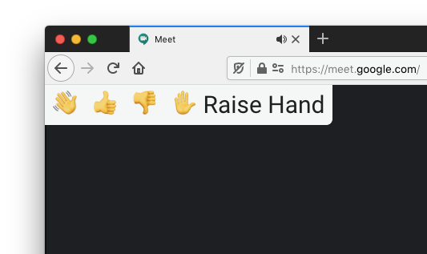

 

Wave is a Firefox/Chrome compatible alternative to the [Nod extension for Google meet](https://chrome.google.com/webstore/detail/nod-reactions-for-google/oikgofeboedgfkaacpfepbfmgdalabej), which is currently Chrome-only. It can be used in meetings with mobile participants because it sends the emoji as chat messages so other people in the meet don't need to have the extension installed to see them, and the Google Meet mobile app does not allow extensions.

## Comparison

|                                                                     | Nod     | Wave |
| ------------------------------------------------------------------- | ------- | ---- |
| Chrome web store                                                    | ✅      | ❌   |
| Chrome extension                                                    | ✅      | ✅   |
| Firefox extension                                                   | Not yet | ✅   |
| Meeting participants can receive emoji without having it installed. | ❌      | ✅   |
| Animated emoji                                                      | ✅      | ❌   |
